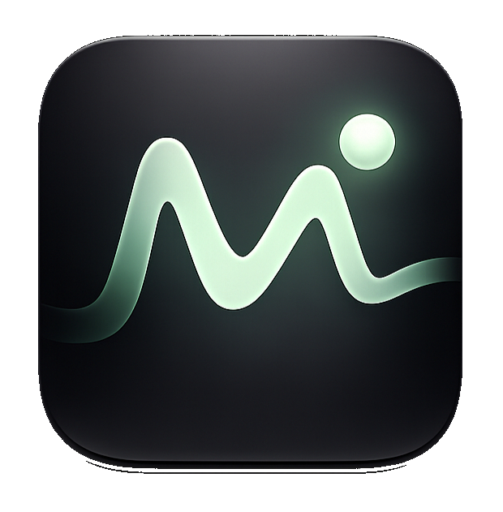

<div align="center">



# Memosa

**Local-first meeting recorder for macOS.** Records audio, transcribes on-device with Whisper, and organises everything into a searchable library — nothing leaves your machine unless you choose.

<p>
  <a href="https://github.com/fru-dev3/memosa/releases/latest/download/Memosa-mac-arm64.dmg"></a>
  <a href="https://apps.apple.com/us/app/memosa-meeting-memory/id6760445178?mt=12"></a>
</p>

<p>
  <a href="https://github.com/fru-dev3/memosa/releases/latest"></a>
  
  
</p>

**[⤓ Download the latest `.dmg`](https://github.com/fru-dev3/memosa/releases/latest/download/Memosa-mac-arm64.dmg)** &nbsp;·&nbsp; [Mac App Store](https://apps.apple.com/us/app/memosa-meeting-memory/id6760445178?mt=12) &nbsp;·&nbsp; [all releases](https://github.com/fru-dev3/memosa/releases)

</div>

## What it does

- Records meetings and calls on your Mac
- Transcribes audio locally using Whisper (on-device after initial model download)
- Organises recordings by date, tags, people, and custom folders
- **AI summaries, action items & decisions** — local-first via Ollama (private by
  default) or your own Anthropic/OpenAI key (opt-in)
- **Chat with your meetings** — ask questions across your transcript library
  (local retrieval + your chosen engine)
- **Calendar auto-record** — connect Google Calendar (read-only) to record
  meetings automatically, with a 2-minute heads-up
- **AI speaker labels** — speaker-attributed transcript on demand
- **Sync** a meeting to an Obsidian vault (local) or a Notion database (your token)
- Exports transcripts and notes to any folder or tool you already use

> **Privacy posture:** the default engine (heuristic, or local Ollama) keeps
> everything on your Mac. Cloud options (BYOK summaries, Notion) only send data
> after you explicitly opt in, and they say so in the UI. Calendar uses read-only
> scope and stores its token in the macOS Keychain.

## Tech stack

- **Frontend** — React + TypeScript + Vite
- **Backend** — Rust via Tauri 2
- **Transcription** — whisper-rs (on-device)
- **Storage** — SQLite (FTS5 full-text search) + local file system
- **Audio** — CoreAudio via Objective-C (no subprocess, MAS sandbox compliant)

## Requirements

- macOS 13.0 or later
- Rust (latest stable)
- Node.js 18+

## Development

```bash
# Install dependencies
npm install

# Start dev server (Vite only — see note below)
npx vite

# Build Rust binary
cd src-tauri && cargo build --no-default-features --features whisper-rs

# For microphone access in dev, wrap in a signed .app bundle
# See: src-tauri/src/audio/permissions.rs
```

> **Note on mic permissions in dev:** macOS requires a signed `.app` bundle to show
> the microphone permission dialog. Running the binary directly will silently deny access.
> Build the bundle and launch via `open` to trigger the TCC prompt.

## Release build

```bash
npm run tauri build
# Output: target/release/bundle/macos/Memosa.app
```

Signed, notarized `.dmg` releases are produced in CI by pushing a `v*` tag — see
[docs/RELEASING.md](docs/RELEASING.md).

## Project structure

```
src/                    React frontend
src-tauri/src/          Rust backend
  audio/                Recording, mic permissions, CoreAudio helpers
  transcription/        Whisper integration, job queue, insight orchestration
  insights/             AI insight engines (Ollama / BYOK Anthropic·OpenAI)
  calendar/             Google Calendar OAuth (PKCE), auto-record scheduler
  chat/                 "Chat with your meetings" — FTS retrieval + LLM
  sync/                 Obsidian (local) + Notion sync
  storage/              SQLite DB, file system, settings, cleanup
  export/               Export providers (local bundle)
  macos.rs              ObjC bridge (audio, URL open, Finder reveal)
  macos_helpers.m       Objective-C implementations
src-tauri/entitlements.plist   App sandbox entitlements (incl. loopback OAuth)
src-tauri/Info.plist           macOS metadata and privacy strings
```

## Configuration

All optional; configured in **Settings**. Secrets (OAuth/Notion tokens, BYOK
keys) live in the macOS Keychain, never on disk.

- **AI Insights** (Settings → AI Insights): choose *Built-in* (offline),
  *Ollama* (local — run `ollama pull llama3.1`), or *Cloud (BYOK)* with your own
  Anthropic/OpenAI key. "Regenerate all" re-runs insights across your library.
- **Calendar** (Settings → Calendar): paste a Google Cloud **OAuth desktop
  client ID** (see `docs/google-calendar-setup.md`), connect, and toggle
  auto-record. Read-only scope; loopback redirect `http://localhost:8899/callback`.
- **Integrations** (Settings → Integrations): pick an Obsidian vault folder
  and/or add a Notion integration token + database ID. Sync per-meeting from a
  recording's sidebar.

## Privacy

All audio and transcripts are stored locally at the path you configure in Settings.
Whisper models are downloaded from the internet on first use, then all processing runs on-device.
The app is sandboxed and targets the Mac App Store.

## License

Memosa is free software, released under the **GNU General Public License v3.0**.
You may use, study, share, and modify it; derivative works must also be released
under the GPL-3.0. See [LICENSE](LICENSE) for the full text.

Copyright © 2026 Fru Louis · fru.dev

The name "Memosa", its logo, and the Mac App Store listing are not covered by the
code license.
